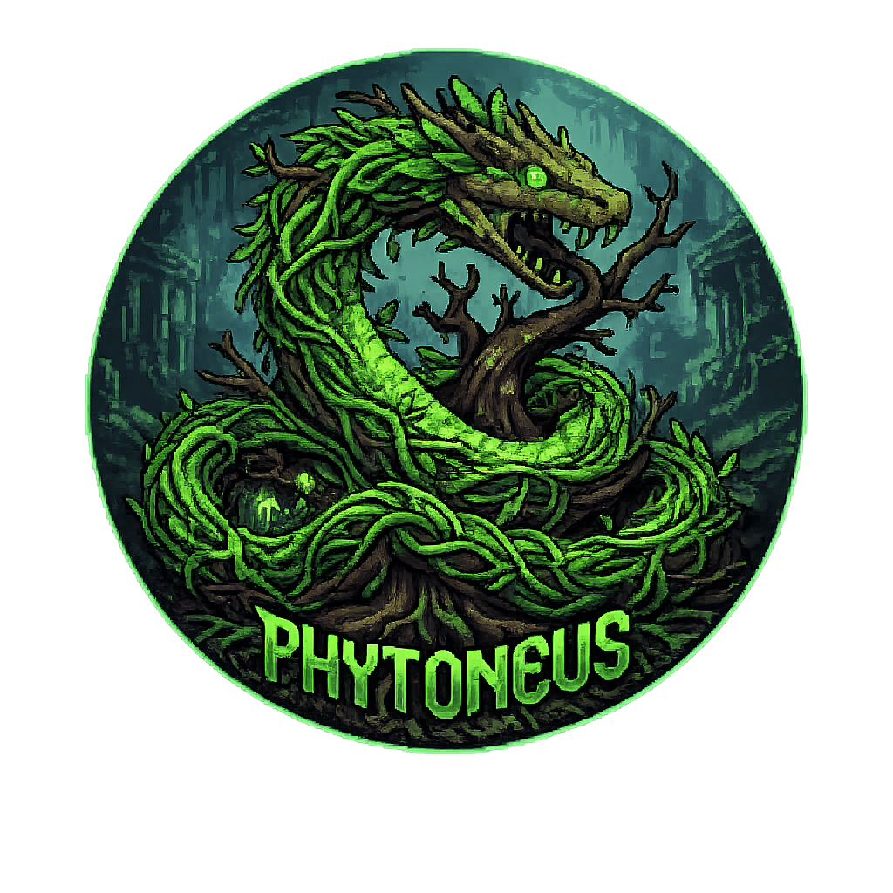

  

  <h1>Pythoneus</h1>

  

  
<em>"The serpent coils toward the truth."</em>

  

---

## Hello

Thanks for stopping by! I'm **Pythoneus** — a developer who loves to tinker and feels most at home in the quiet focus of a terminal.

My name is a small nod to two worlds: the **Python** language and the **Python of Delphi** from Greek mythology — the great serpent that once guarded the oracle of truth. That same curiosity, the urge to truly understand things and solve them elegantly, is what drives me.

- At home on **Linux**, preferably right at the command line
- Drawn to clean code, well-considered solutions, and learning new things
- Away from the screen, somewhere between anime, pixel art, and creative ideas
- Always open to good conversations and fresh perspectives

---

## Tech Stack

**Languages**

**System & Environment**

**Tools**

---

## GitHub Statistics

  
  

   

  

    

  

  
Trophies

   
  

---

<!--
  Optional: animated contribution snake.
  This graphic only appears once the workflow
  .github/workflows/snake.yml has run at least once (Actions tab -> Run workflow).
  If you don't want it, simply delete this block.
-->

  

---

  <em>"The code is the compass; the truth is the destination."</em>
    
  

